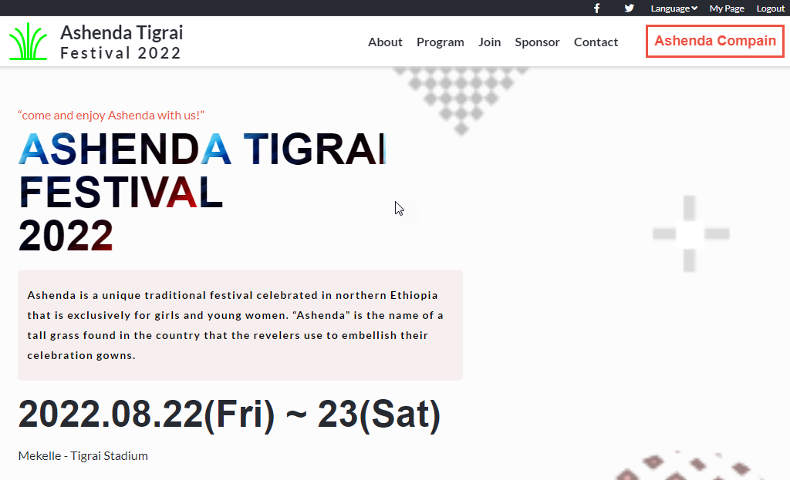

# Ashenda

> Ashenda Tigrai Festival 2022

This website is designed as part of compain for a yearly culutral event that takes places in the northern part of Ethiopia - Ashenda Festival 2022.

## Built With

- HTML, CSS and JavaScript

## Live Demo

[Live Demo Link](https://gtekle.github.io/Ashenda/)
[Video Demo Link](https://www.loom.com/share/3238186761d54c5a8be6539628b5279c)

## Getting Started

-Install Node.js
-Install text editor of your choice (eg. VS Code)

## Authors

👤 **Tekle G**

- GitHub: [@githubhandle](https://github.com/gtekle)
- LinkedIn: [LinkedIn](www.linkedin.com/in/tekle-gebreyohannes-kidanemariam-7605752b)

## 🤝 Contributing

Contributions, issues, and feature requests are welcome!

Feel free to check the [issues page](../../issues/).

## Show your support

Give a ⭐️ if you like this project!

## Acknowledgments

- Microverse Inc
- [Creative Commons license of the design](https://creativecommons.org/licenses/by-nc/4.0/)

## 📝 License

This project is [MIT](./MIT.md) licensed.
